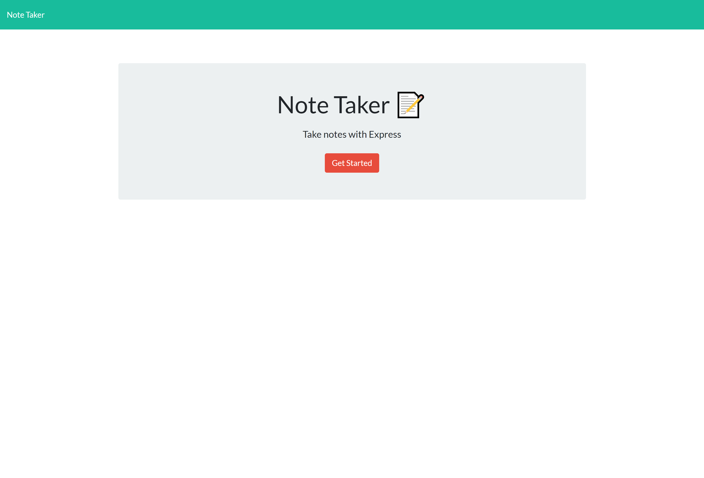
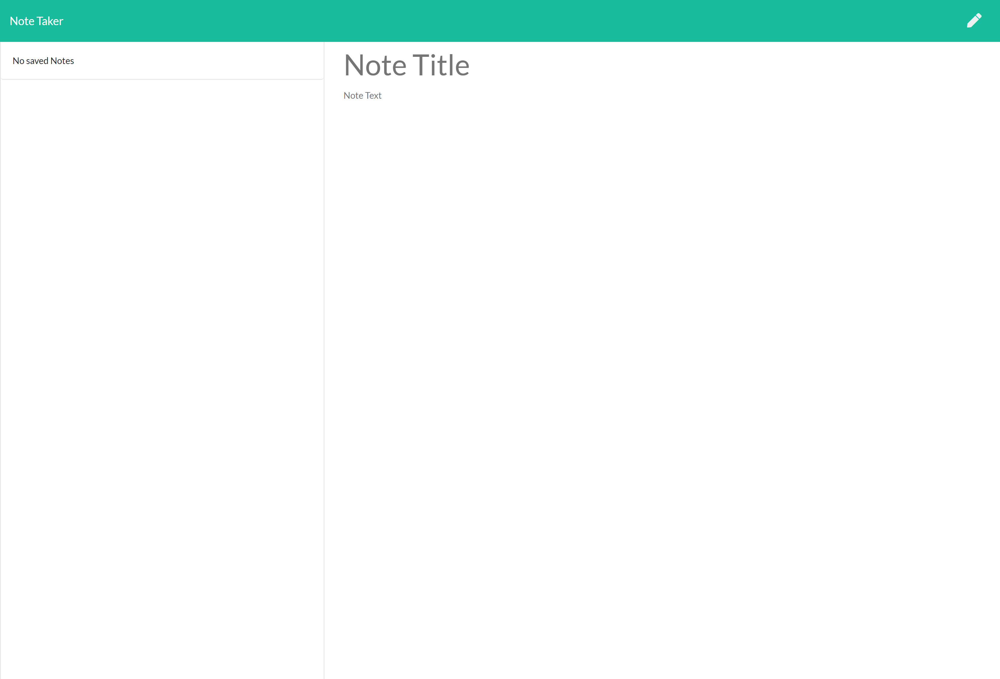
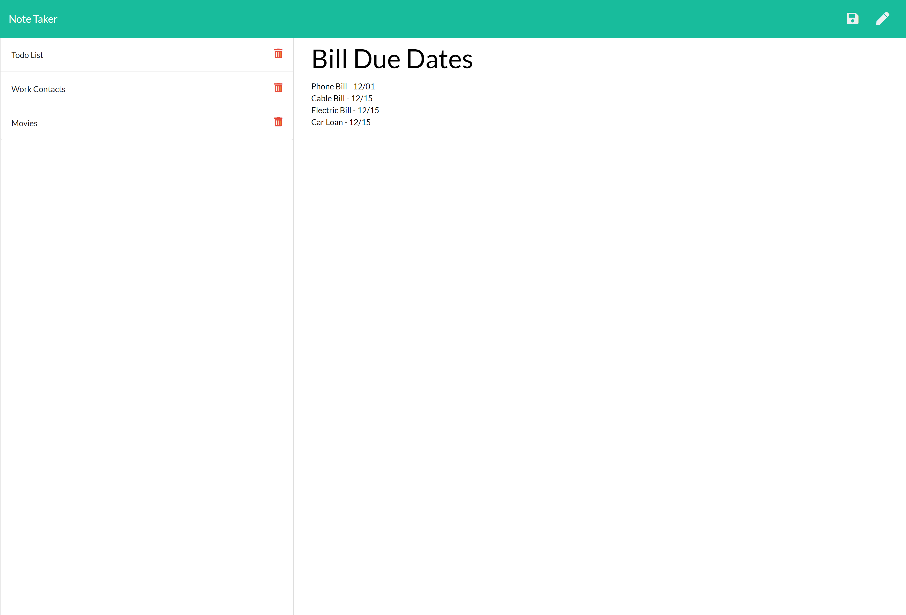

# NoteTaker

## Description

It's easy to forget or be unable to recall something important. Being able to take persistent notes allows you to have written information available when needed. In order to help people with this our task was to create an application that can be used to write, save, and delete notes. The application uses an express backend to save and retrieve note data from a JSON file. Putting all this together will make the users life a lot easier!!

## User Story

```
AS A user, I want to be able to write and save notes

I WANT to be able to delete notes I've written before

SO THAT I can organize my thoughts and keep track of tasks I need to complete
```

## Table of Contents

* [Usage](#usage)

* [Contributing](#Contributing)

* [Heroku Link](#heroku)

* [ScreenShots of Completed App](#screenshots)

* [Contact](#contact)

## Usage

The main purpose of this app is for users that need to keep track of a lot of information. It's easy to forget or be unable to recall something important. Being able to take persistent notes allows users to have written information available when needed.

## Contributing

If you are interested in contributing to this app please contact the owner of this repo via email. If given approval please follow these steps:

* Fork this repository.
* Create a branch: git checkout -b <branch_name>.
* Make your changes and commit them: git commit -m '<commit_message>'
* Push to the original branch: git push origin <project_name>/<location>
* Create the pull request.

Alternatively see the GitHub documentation on [creating a pull request](https://docs.github.com/en/free-pro-team@latest/github/collaborating-with-issues-and-pull-requests/creating-a-pull-request).

## Heroku

Please check out the following link to see the finished product:

[Deployed App](https://dm-note-taker.herokuapp.com/)

## ScreenShots







## Contact
If you have any questions regarding this project and would like to reach out to me please feel free to do so at the following email: dimitarm01@gmail.com. Thank you.

Check Out My Github Page:
[Github](https://github.com/dspark8916)